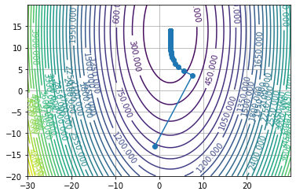

# Лабораторная работа № 6. Безусловный экстремум.

Выполнила студент группы 426  
Патянин Сергей Сергеевич

## Вариант № 5
Найти точку **минимума** функции

.png)

методом наискорейшего спуска  . Для одномерной минимизации использовать метод половинного деления . Для поиска интервала унимодальности использовать алгоритм скользящего окна. В окрестности точки минимума построить линии уровня и траекторию поиска (на одном графике). За своевременное выполнение задания начисляется 6 баллов.Реализовав дополнительно следующие методы можно получить по 3 балла за каждый метод: метод случайного поиска, метод Нелдера-Мида, метод Пауэлла, метод Хука-Дживса, метод Розенброка.

## Теоретическая часть
**Метод наискорейшего спуска** 

Метод наискорейшего спуска (в англ. литературе «method of steepest descent») - это итерационный численный метод (первого порядка) решения оптимизационных задач, который позволяет определить экстремум (минимум или максимум) целевой функции: 

.png) - это значения аргумента функции (управляемые параметры) на вещественной области. 

В соответствии с рассматриваемым методом экстремум (максимум или минимум) целевой функции определяют в направлении наиболее быстрого возрастания (убывания) функции, т.е. в направлении градиента (антиградиента) функции. Градиентом функции  в точке  .png)  называется вектор, проекциями которого на координатные оси являются частные производные функции по координатам:

.png)

где i, j,…, n - единичные векторы, параллельные координатным осям. 

Градиент в базовой точке .png) строго ортогонален к поверхности, а его направление показывает направление наискорейшего возрастания функции, а противоположное направление (антиградиент), соответственно, показывает направление наискорейшего убывания функции.  

Метод наискорейшего спуска является дальнейшим развитием метода градиентного спуска. В общем случае процесс нахождения экстремума функции является итерационной процедурой, которая записывается следующим образом: 

.png)

где знак «+» используется для поиска максимума функции, а знак «-» используется для поиска минимума функции; 

.png) -  единичный вектор направления, который определяется по формуле: 

.png)

.png) - модуль градиента определяет скорость возрастания или убывания функции в направлении градиента или антиградиента: 

.png)

.png) - константа, определяющая размеры шага и одинаковая для всех i-х направлений. 

Величина шага выбирается из условия минимума целевой функции f(х) в направлении движения, т. е. в результате решения задачи одномерной оптимизации в направлении градиента или антиградиента: 

.png)

Другими словами, величину шага .png) определяют при решении данного уравнения: 

.png)

Таким образом, шаг расчета выбирается такой величины, что движение выполняется до тех пор, пока происходит улучшение функции, достигая, таким  образом, экстремума в некоторой точке. В этой точке вновь определяют  направление поиска (с помощью градиента) и ищут новую точку оптимума целевой функции и т.д. Таким образом, в данном методе поиск происходит  более крупными шагами, и градиент функции вычисляется в меньшем числе точек. 

Поиск оптимального решения завершается в случае, когда на итерационном шаге расчета (несколько критериев):

- траектория поиска остается в малой окрестности текущей точки поиска:

- приращение целевой функции не меняется:

- градиент целевой функции в точке локального минимума обращается в нуль: 

**Метод половинного деления** 

Считаем, что отделение корней произведено и на интервале [a,b] расположен один корень, который необходимо уточнить с погрешностью ε.
Итак, имеем f(a)f(b)<0. Метод дихотомии заключается в следующем. Определяем половину отрезка c=½(a+b) и вычисляем f(c). Проверяем следующие условия
1. Если |f(c)| < ε, то c – корень. Здесь ε - заданная точность.
2. Если f(c)f(a)<0, то корень лежит в интервале [a,c].
3. Если f(c)f(b)<0, то корень лежит на отрезке[c,b].
Продолжая процесс половинного деления в выбранных подынтервалов, можно дойти до сколь угодно малого отрезка, содержащего корень ξ.

**Алгоритм скользящего окна** .

Для выбранной исходной точки x0 и выбранного окна шириной 2h > 0 около точки x0 проверяется условие унимодальности

f(x0 h) > f(x0) < f(x0 + h)

Если условие выполнено, то считается, что интервал унимодальности найдён, в противном случае проверяется условие

f(x0 h) > f(x0 + h)

Если последнее выполнено, тогда окно сдвигается вправо от точки x на h=2, иными словами, точка x заменяется на точку x = x + h=2.

В противном случае окно сдвигается влево от точки x.

## Практическая часть
Функция `f(double x, double y)` возвращает значение исходной функции в точке x, `f_dx(double x, double y)` и `f_dy(double x, double y)` - производные по первой и второй переменной соответственно, `f_sc(double *x, double a, double p)` - значение в точке x + ap,`g(double x, double y, double alpha)`- это функция g d методе наискорейшего (градиентного) спуска. Метод скользящего окна `mso(double *x, double *p)` возвращает середину отрезка унимодальности, метод половинного деления ` Dihotomia(double a0, double b0, double epsilon, double x, double y)` возвращает точку минимума функции, Метод наискорейшего спуска ` GreatDescent(  double bx, double by, double epsilon)` выводит на экран точку минимума функции и значение функции в этой точке. Компиляция `g++ main.cpp -o main`. 

### Результаты
В результате работы программы у функции .png) был найден экстремум в точке [2.5, 14] (начальная точка [-1, -13]) за 69 итерации методами наискорейшего спуска, половинного деления, скользящего окна с точностью 1е-3. Ниже приведен рисунок с изображением линий уровня анализируемой функции и траектория поиска экстремума:

