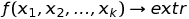

# Лабораторная работа № 6. Безусловный экстремум.

Выполнила студент группы 426  
Патянин Сергей Сергеевич

## Вариант № 5
Найти точку **минимума** функции

.png)

методом наискорейшего спуска  . Для одномерной минимизации использовать метод половинного деления . Для поиска интервала унимодальности использовать алгоритм скользящего окна. В окрестности точки минимума построить линии уровня и траекторию поиска (на одном графике). За своевременное выполнение задания начисляется 6 баллов.Реализовав дополнительно следующие методы можно получить по 3 балла за каждый метод: метод случайного поиска, метод Нелдера-Мида, метод Пауэлла, метод Хука-Дживса, метод Розенброка.

## Теоретическая часть
Метод наискорейшего спуска (в англ. литературе «method of steepest descent») - это итерационный численный метод (первого порядка) решения оптимизационных задач, который позволяет определить экстремум (минимум или максимум) целевой функции: 

.png) - это значения аргумента функции (управляемые параметры) на вещественной области. 
В соответствии с рассматриваемым методом экстремум (максимум или минимум) целевой функции определяют в направлении наиболее быстрого возрастания (убывания) функции, т.е. в направлении градиента (антиградиента) функции. Градиентом функции  в точке  .png)  называется вектор, проекциями которого на координатные оси являются частные производные функции по координатам:
.png)

